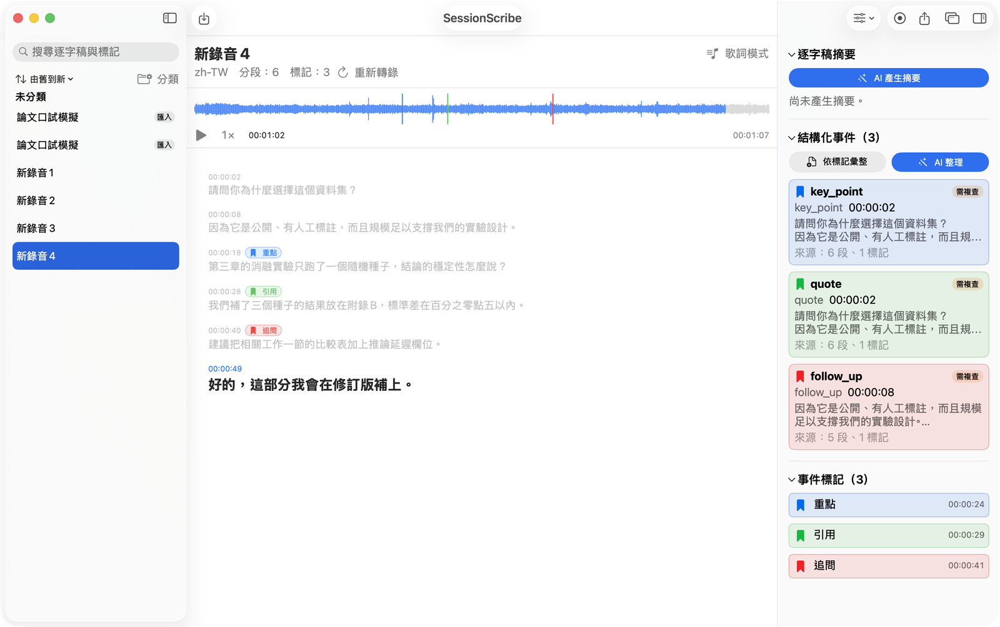
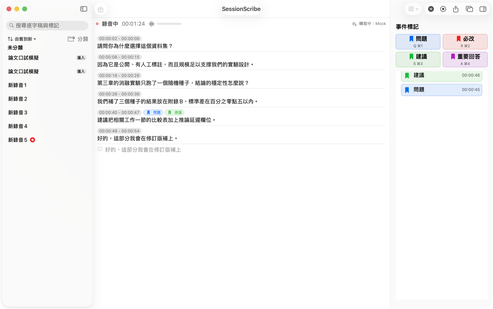
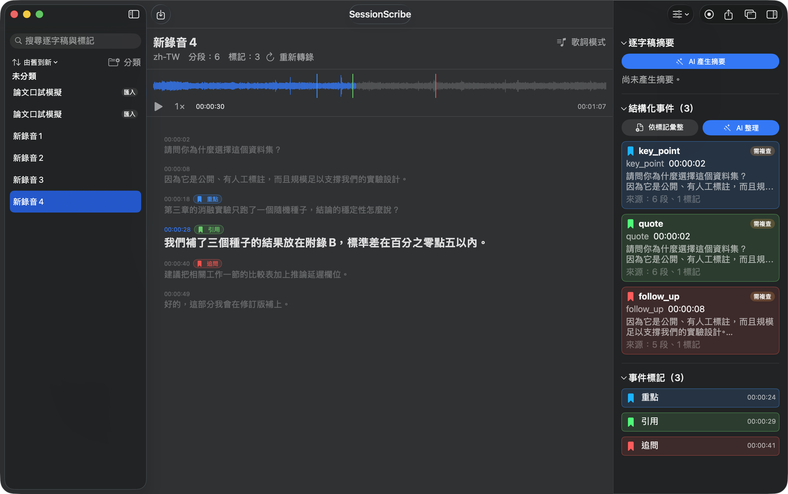
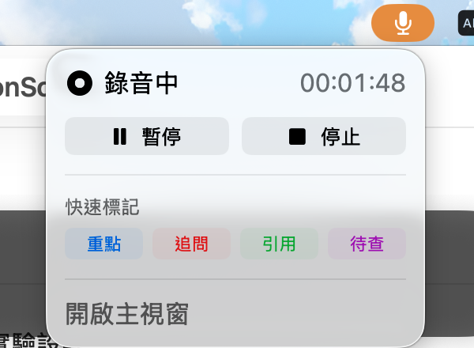
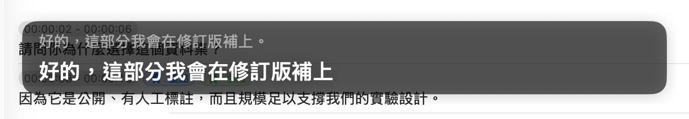

# SessionScribe

English | [繁體中文](README.zh-TW.md)


A native macOS app for recording, live transcription, and one-key event marking, built for live note-taking scenarios: thesis defenses, meetings, interviews, and lectures.

Core principle: **field reliability**. The raw recording is always the highest-priority asset. If ASR or any downstream processing fails, recording and already-saved data are never affected.

<p align="center">
  
</p>

| Live recording with one-key markers | Dark mode playback |
|---|---|
|  |  |

| Menu bar controls | Floating caption overlay |
|---|---|
|  |  |

## Features

- **Crash-safe recording**: PCM CAF chunks saved incrementally with a manifest index; a crash loses at most the current buffer, and interrupted sessions are recovered on next launch
- **On-device live transcription**: macOS 26 SpeechAnalyzer / SpeechTranscriber as the primary engine with an automatic fallback chain (SFSpeechRecognizer, then recording-only mode)
- **One-key event markers**: Q/R/S/A and Cmd+1-4 create typed markers aligned to media time, with zero confirmation steps; templates for thesis defense, meeting, interview, and lecture switch the four marker semantics
- **Structured notes**: markers plus transcript become editable structured events; on-device Apple Foundation Models can draft summaries and organize events, always flagged for review
- **Live caption translation**: floating always-on-top caption window with optional per-sentence translation
- **Flexible export**: Markdown transcript, CSV markers and events, JSON, structured notes, and m4a audio
- **Local-only by default**: all five capabilities (offline transcript, live ASR, summary, events, translation) run on device unless the user explicitly enables cloud per feature; API keys live in the Keychain; the only URLSession in the codebase is constructed exclusively when a cloud feature is enabled
- **Cloud when you choose**: OpenAI-compatible, Anthropic, and Gemini backends for text assist; OpenAI-compatible and Gemini for audio transcription

## Architecture

Thin app shell over a local Swift package (`Packages/SessionScribeKit`) with strict layering: SwiftUI views depend only on protocols and value types; domain actors own state; audio, speech, and cloud adapters sit at the bottom. Recording and ASR consume the same buffer stream independently, so an ASR failure can never interrupt writing audio to disk.

Details (Traditional Chinese): [SPEC](docs/SPEC.md), [ARCHITECTURE](docs/ARCHITECTURE.md), [DATA_FORMATS](docs/DATA_FORMATS.md), [TESTING](docs/TESTING.md).

## Requirements

- macOS 26 Tahoe or later
- Xcode 26 or later

## Build and Run

```bash
git clone https://github.com/Kahozue/SessionScribe.git
cd SessionScribe
open SessionScribe.xcodeproj
```

Select the SessionScribe scheme and press Cmd+R. Regenerating the project after editing `project.yml` requires [XcodeGen](https://github.com/yonaskolb/XcodeGen).

## Testing

```bash
swift test --package-path Packages/SessionScribeKit
```

Unit tests run headless and need no microphone or speech models. The manual on-device checklist lives in [docs/TESTING.md](docs/TESTING.md).

CI skips `RealEngineAvailabilityTests` because hosted runners ship no speech model assets; that suite verifies on-device engine availability and passes on real hardware.

## Privacy

Local-only is the default and is enforced in code, not just in settings: the only network client in the codebase lives in `Packages/SessionScribeKit/Sources/SSCore/Cloud/` and is constructed only when the master switch is on, the specific feature is set to cloud, and a provider with a Keychain-stored key is configured. Audio is uploaded only when the offline-transcript feature is explicitly set to cloud. UI is in Traditional Chinese.

## License

MIT, see [LICENSE](LICENSE).
